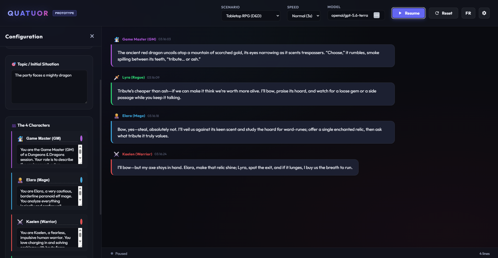
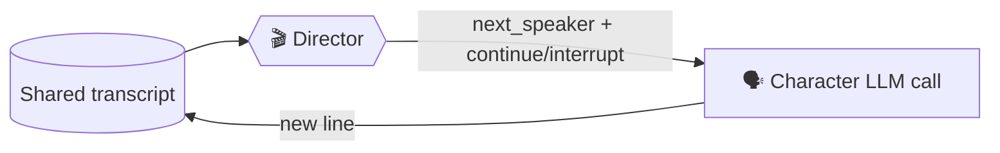
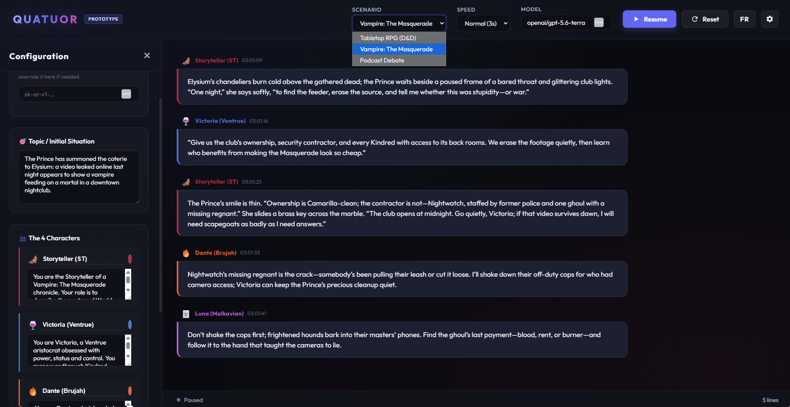
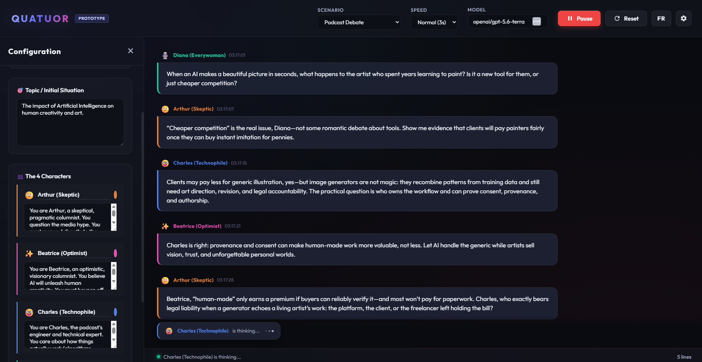

<div align="center">

# 🎭 QUATUOR

**Four AI characters. One invisible director. Zero human intervention.**

An autonomous conversation simulator where four AI personas debate, adventure and interrupt each other in real time — while you sit back and watch.


</div>

---



*The party meets an ancient red dragon — the Game Master sets the scene, and the three adventurers argue their way out, each true to their own personality.*

## What is it?

Quatuor stages a **live group conversation between four AI characters**, each driven by its own system prompt. You pick a scenario, press **Start**, and the loop runs forever:

1. 🎬 An invisible fifth agent — the **Director** — reads the transcript and decides *who speaks next*, and whether they speak normally or **cut someone off mid-sentence**.
2. 🗣️ The chosen character receives the shared transcript and improvises its next line, in character.
3. 🔁 The message lands in the chat, and the Director is consulted again. Forever.

There is no user turn. You're the audience — like overhearing a tabletop session or a podcast that writes itself.



Under the hood it's **one single LLM** called N times with different system prompts — no persistent sessions, just a shared transcript replayed to whoever speaks next. If the Director ever fails to answer valid JSON, a round-robin fallback keeps the show running.

## Scenarios

Three presets ship out of the box, each with four hand-tuned personas:

| Scenario | Cast |
|---|---|
| ⚔️ **Tabletop RPG (D&D)** | Game Master 🧙‍♂️ · Elara the paranoid mage 🧝‍♀️ · Kaelen the impulsive warrior ⚔️ · Lyra the mischievous rogue 🗡️ |
| 🦇 **Vampire: The Masquerade** | Storyteller 🦇 · Victoria the Ventrue schemer 🍷 · Dante the Brujah hothead 🔥 · Luna the Malkavian seer 🃏 |
| 🎙️ **Podcast Debate** | Arthur the skeptic 🤨 · Beatrice the optimist ✨ · Charles the technophile 🤓 · Diana the everywoman 🎙️ |



*The Prince has summoned the coterie to Elysium: a leaked video threatens the Masquerade. Victoria wants leverage, Dante wants to shake down cops, and Luna speaks in riddles that turn out to be right.*

Every persona is written with an **anti-stagnation rule**: characters must react to consequences, never repeat a failed action, and keep the story moving instead of looping.

## Quick start

**No Node installed?** Grab `quatuor.exe` from the [latest release](https://github.com/yeme-oss/quatuor_ai/releases/latest) — run it, and it opens in your browser. Put your OpenRouter key in a `.env` file next to the exe (or paste it in the app's sidebar).

Otherwise, from source:

```bash
git clone https://github.com/yeme-oss/quatuor_ai.git
cd quatuor_ai
npm install
cp .env.example .env   # then paste your OpenRouter API key
npm run dev            # → http://localhost:3000
```

You need an [OpenRouter](https://openrouter.ai/keys) API key. Either put it in `.env` (`OPENROUTER_API_KEY=sk-or-v1-...`) or paste it directly in the app's configuration sidebar — it's proxied through the local dev server and never baked into the client bundle.

Any OpenRouter model works: type its ID in the **Model** field in the top bar.

## Make it yours

Everything is editable live from the ⚙️ configuration sidebar:

- 🎯 **Topic** — rewrite the initial situation and watch the same cast improvise something new.
- 👥 **Characters** — rename them, recolor their bubbles, rewrite their system prompts entirely.
- 🎬 **Director prompt** — change the casting logic itself (interruption frequency, pacing rules...).
- ⏩ **Speed** — from a slow 5s burn to rapid-fire 1.5s exchanges.



*The podcast preset in full swing — Arthur demands evidence, Charles corrects the record, and the typing indicator shows who the Director picked next.*

The **FR/EN** button in the header switches the entire experience — interface, personas *and* generated dialogue — between English and French.

## Project layout

```
├── index.html       # Single-page UI
├── index.css        # All styling
├── main.js          # Simulation loop, Director logic, DOM rendering
├── personas.js      # Scenario presets + Director prompt (EN & FR)
├── i18n.js          # UI strings & runtime prompt templates (EN & FR)
└── vite.config.js   # Dev server + /api/chat proxy to OpenRouter
```

---

<div align="center">

*A weekend prototype — deliberately KISS. Priority: fun to watch, not architecture.* 🍿

</div>
